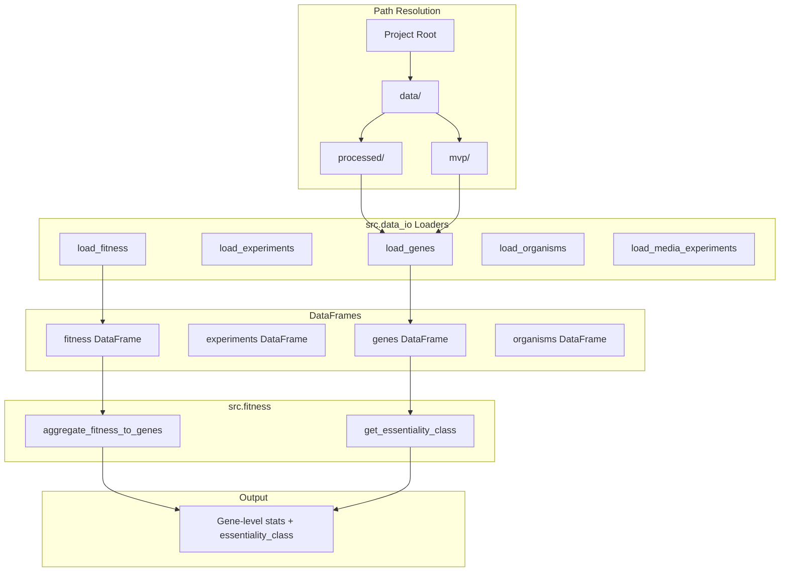

# Logic flow

Step-by-step pipeline from path resolution to gene-level stats and essentiality class. Planned steps (embeddings, model training) are noted as not yet implemented.

---

## Pipeline steps

### 1. Path resolution

- **Project root:** `_project_root()` — from environment variable `GENEESSENTIALITY_ROOT` if set, otherwise the parent of the directory containing `src/`.
- **Data directories:** `get_data_dir()` → `project_root/data`; `get_processed_dir()` → `data/processed`; `get_mvp_dir()` → `data/mvp`. All loaders use these helpers; do not hardcode `data/` paths in shared code.

### 2. Load data

Choose subset `"processed"` or `"mvp"`. Call:

- `load_genes(subset)` → genes DataFrame
- `load_experiments(subset)` → experiments DataFrame
- `load_fitness(subset)` → fitness DataFrame
- `load_organisms(subset)` → organisms DataFrame
- Optionally: `load_media_experiments()` (reads `data/media_composition.xlsx`, sheet 2)

### 3. Fitness aggregation (optional)

`aggregate_fitness_to_genes(fitness)` takes the raw fitness table (columns `orgId`, `locusId`, `expName`, `fit`, `t`) and returns a DataFrame with one row per `(orgId, locusId)` and columns:

- `n_total_experiments`, `n_confident_experiments` (confident = \|t\| ≥ 2)
- `frac_not_confident`, `mean_fit_confident`
- `frac_essential_all`, `frac_essential_confident` (essential in an experiment = fit &lt; −1)
- `essentiality_class`

Implementation uses vectorized groupby/agg only (no row-wise loops). Gene metadata (scaffoldId, begin, end, etc.) is not added; merge with the genes table if needed.

### 4. Essentiality classification

`get_essentiality_class(frac_essential_confident, n_confident)` returns a class label (or array of labels). Rules (from `src/fitness.py`):

- `n_confident == 0` → `"no_data"`
- `frac_essential_confident > 0.8` → `"always_essential"`
- `0.1 ≤ frac_essential_confident ≤ 0.8` → `"conditional"`
- `frac_essential_confident < 0.1` (and n_confident &gt; 0) → `"non_essential"`

If you use `aggregate_fitness_to_genes`, `essentiality_class` is already computed; otherwise call `get_essentiality_class` on your own aggregates.

---

## Data flow diagram

---

## Planned steps (not implemented)

**Execution order:**

1. **Pipeline orchestration:** Run `scripts/run_pipeline.py` to execute steps (extract_data → classify_genes → filter_mvp → create_fastas → generate_embeddings → label_embeddings). Use `--step`, `--from`, or `--to` for partial runs.
2. **Embeddings (done):** Per-organism .pt files in `data/mvp/ProtLM_embedddings/`. Each .pt: `embeddings`, `group_labels`. Produced by `generate_embeddings` step.
3. **Y label vectors (done):** `label_embeddings` step adds `y` to each .pt; output in `data/mvp/ProtLM_embeddings_with_labels/`.
4. **MLP baseline (immediate next step):** Load .pt from `data/mvp/ProtLM_embeddings_with_labels/`; filter to y ≠ -1. Train MLP: embedding → 3-class. Organism-based split (~19/4/4). Metrics: AUPRC (always_essential, conditional), accuracy, weighted F1.
